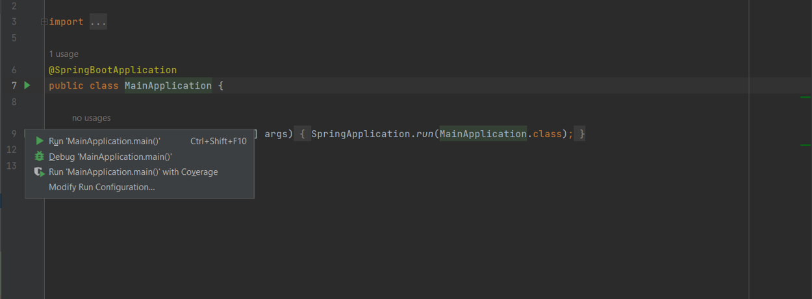
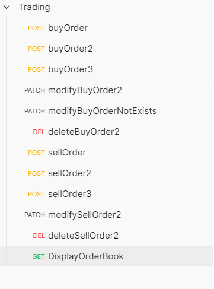

Demo Project
# Getting Started

## Softwares used.
1. Intellij,
2. Java 8
3. Postman
4. Spring boot framework
5. Maven
6. Git, Github

## how to run the application


As shown in the above image open the ClientServiceApplication click on the green colour run symbol and click on run option.

### Reference Documentation
There are 3 apis
1. createOrder
2. updateOrder
3. deleteOrder


### Sample Postman collection is attached in the repo root location

### 

For successful cases please follow the same order in which the collection requests are there.

### 1. createOrder: This API is used for creating a order

#### API Details
     url:- http://localhost:8081/order
     METHOD:- POST
####  Sample payload
For sell order creation update the payload with side attribute as sell 
```
    {
    "price": 9,
    "quantity": 90,
    "side": "buy"
    }
```
####  Sample response payload
```
    {
    "id": "2de264c8-098c-4d68-9e72-27cc46150c9a",
    "price": 9,
    "quantity": 90,
    "side": "buy"
}
```

### 2 . updateOrder: This API is used for updating a order

#### API Details
     url:- http://localhost:8081/order/{refId}
     METHOD:- PATCH
```
    sample url : http://localhost:8081/order/5ce26757-0713-48dc-858b-ef377edc3978?quantity=35
```
####  Sample parameter
```
{
    "quantity": 35
}
```

#### Sample response payload

```
{
    "id": "5ce26757-0713-48dc-858b-ef377edc3978",
    "price": 9,
    "quantity": 35,
    "side": "buy"
}

```
### 3 . deleteOrder: This API is used for deleting an order

#### API Details
     url:- http://localhost:8081/order/{refId}
     METHOD:- DELETE
```
    sample url : http://localhost:8081/order/5ce26757-0713-48dc-858b-ef377edc3978
```

#### Sample response payload

```
Order has been Successfully deleted !!!!
```
### 6 . displayOrderBook: This API is used for displaying orders

#### API Details
     url:- http://localhost:8081/order
     METHOD:- GET
```
    sample url : http://localhost:8081/order
```


#### Sample response payload

```
{
    "buyList": {
        "9": [
            {
                "id": "2de264c8-098c-4d68-9e72-27cc46150c9a",
                "price": 9,
                "quantity": 90,
                "side": "buy"
            },
            {
                "id": "0ce8b273-cf97-48bc-83be-d148a88bf9db",
                "price": 9,
                "quantity": 50,
                "side": "buy"
            }
        ]
    },
    "sellList": {}
}
```